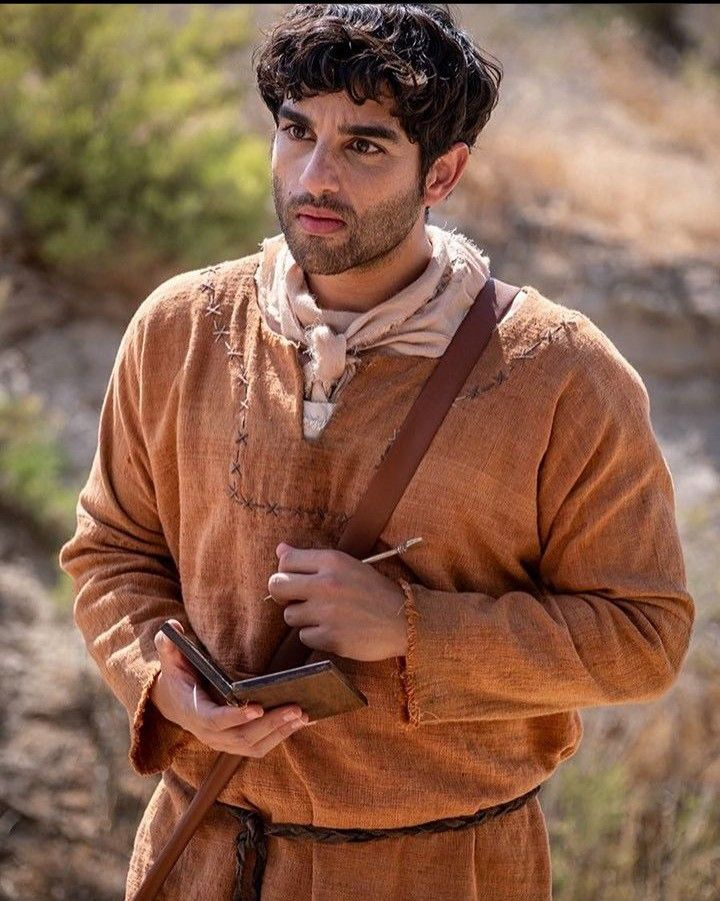

<!DOCTYPE html>
<html lang="es" class="scroll-smooth">
<head>
    <meta charset="UTF-8">
    <meta name="viewport" content="width=device-width, initial-scale=1.0">
    <title>Alex.VFX | Video Editor & Content Creator</title>
    
    <link href="https://fonts.googleapis.com/css2?family=Inter:wght@300;400;500;600;700;800&display=swap" rel="stylesheet">
    <link rel="stylesheet" href="https://cdnjs.cloudflare.com/ajax/libs/font-awesome/6.4.0/css/all.min.css">
    
</head>
<body class="min-h-screen">

    <!-- NAVBAR -->
    <nav class="fixed top-0 w-full bg-black/80 backdrop-blur-lg border-b border-neutral-800 z-50">
        

            <a href="#" class="text-lg font-semibold tracking-tight">
                Alex.VFX
            </a>
            

                <a href="#work" class="hover:text-white transition-colors">Trabajos</a>
                <a href="#about" class="hover:text-white transition-colors">Sobre mí</a>
                <a href="#contact" class="hover:text-white transition-colors">Contacto</a>
            

            <a href="#contact" class="text-sm px-4 py-2 border border-neutral-700 hover:border-gold hover:text-gold transition-all rounded-full">
                Contratar
            </a>
        

    </nav>

    <!-- PERFIL ESTILO RED SOCIAL -->
    <section class="pt-32 pb-16 px-6">
        

            <!-- Tarjeta de perfil -->
            

                <!-- Banner/Cover -->
                

                    

                

                
                <!-- Contenido del perfil -->
                

                    <!-- Avatar superpuesto -->
                    

                        

                            
                        

                    

                    
                    <!-- Nombre y verificación -->
                    

                        <h1 class="text-2xl sm:text-3xl font-bold tracking-tight">Alex.VFX</h1>
                        
                            <i class="fa-solid fa-check text-[10px]"></i>
                        
                    

                    
                    <!-- Título profesional -->
                    
Video Editor & Content Creator

                    
                    <!-- Bio -->
                    

                        Transformo ideas en piezas visuales que conectan. Especializado en post-producción, motion graphics y color grading.
                    

                    
                    <!-- Ubicación y estado -->
                    

                        <i class="fa-solid fa-location-dot mr-1"></i> Venezuela
                        
                            
                            Disponible
                        
                    

                    
                    <!-- Botones de acción -->
                    

                        <a href="mailto:contacto@alexvfx.com" class="flex-1 px-6 py-3 bg-white text-black text-sm font-semibold rounded-full hover:bg-neutral-200 transition-colors text-center">
                            <i class="fa-regular fa-envelope mr-2"></i> Enviar Email
                        </a>
                        <a href="https://wa.me/tu_numero" target="_blank" class="flex-1 px-6 py-3 border border-neutral-700 text-sm font-semibold rounded-full hover:border-gold hover:text-gold transition-colors text-center">
                            <i class="fa-brands fa-whatsapp mr-2"></i> WhatsApp
                        </a>
                    

                    
                    <!-- Redes sociales -->
                    

                        <a href="#" class="text-neutral-500 hover:text-white transition-colors transform hover:scale-110">
                            <i class="fa-brands fa-youtube text-xl"></i>
                        </a>
                        <a href="#" class="text-neutral-500 hover:text-white transition-colors transform hover:scale-110">
                            <i class="fa-brands fa-instagram text-xl"></i>
                        </a>
                        <a href="#" class="text-neutral-500 hover:text-white transition-colors transform hover:scale-110">
                            <i class="fa-brands fa-tiktok text-xl"></i>
                        </a>
                        <a href="#" class="text-neutral-500 hover:text-white transition-colors transform hover:scale-110">
                            <i class="fa-brands fa-vimeo-v text-xl"></i>
                        </a>
                        <a href="#" class="text-neutral-500 hover:text-white transition-colors transform hover:scale-110">
                            <i class="fa-brands fa-linkedin-in text-xl"></i>
                        </a>
                    

                

            

        

    </section>

    <!-- TRABAJOS -->
    <section id="work" class="py-16 px-6">
        

            

                <h2 class="text-2xl font-semibold tracking-tight">Trabajos Seleccionados</h2>
                2024 — 2026
            

            

                <!-- Proyecto 1 -->
                

                    

                        
                        

                            
                                <i class="fa-solid fa-play text-white"></i>
                            
                        

                    

                    

                        

                            <h3 class="text-lg font-medium mb-1">Nike — Reel Deportivo</h3>
                            
Edición, Motion Graphics, Color Grading

                        

                        2026
                    

                

                <!-- Proyecto 2 -->
                

                    

                        
                        

                            
                                <i class="fa-solid fa-play text-white"></i>
                            
                        

                    

                    

                        

                            <h3 class="text-lg font-medium mb-1">Neon Nights — Videoclip Musical</h3>
                            
Dirección de post, VFX, Sound Design

                        

                        2025
                    

                

                <!-- Proyecto 3 -->
                

                    

                        
                        

                            
                                <i class="fa-solid fa-play text-white"></i>
                            
                        

                    

                    

                        

                            <h3 class="text-lg font-medium mb-1">Tierra — Documental</h3>
                            
Montaje, Corrección de color, Sonido

                        

                        2024
                    

                

            

        

    </section>

    <!-- SOBRE MÍ -->
    <section id="about" class="py-16 px-6 border-t border-neutral-900">
        

            <h2 class="text-2xl font-semibold tracking-tight mb-6">Sobre mí</h2>
            

                Soy editor de video con más de 5 años de experiencia trabajando con marcas, agencias y creadores de contenido. Mi enfoque está en la narrativa visual — cada corte, transición y ajuste de color tiene un propósito.
            

            

                He colaborado con equipos en Latinoamérica y Europa, entregando proyectos que no solo cumplen, sino que superan las expectativas.
            

        

    </section>

    <!-- CONTACTO -->
    <section id="contact" class="py-16 px-6 border-t border-neutral-900">
        

            <h2 class="text-2xl font-semibold tracking-tight mb-4">¿Tienes un proyecto?</h2>
            
Hablemos de cómo puedo ayudarte a llevarlo al siguiente nivel.

            

                <a href="mailto:contacto@alexvfx.com" class="px-6 py-3 bg-white text-black text-sm font-medium rounded-full hover:bg-neutral-200 transition-colors">
                    <i class="fa-regular fa-envelope mr-2"></i> Email
                </a>
                <a href="https://wa.me/tu_numero" target="_blank" class="px-6 py-3 border border-neutral-700 text-sm rounded-full hover:border-neutral-400 transition-colors">
                    <i class="fa-brands fa-whatsapp mr-2"></i> WhatsApp
                </a>
            

        

    </section>

    <!-- FOOTER -->
    <footer class="py-8 px-6 border-t border-neutral-900">
        

            
© 2026 Alex.VFX

            
Editando historias que importan

        

    </footer>

</body>
</html>
